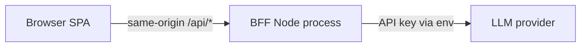
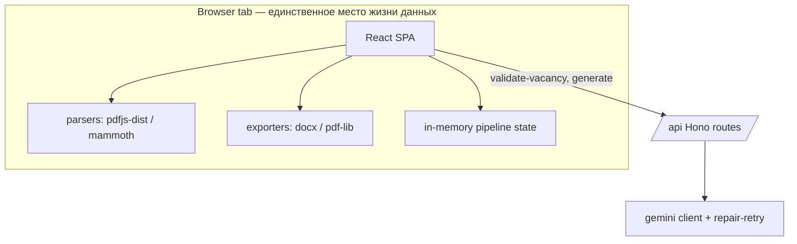

# Architecture Spine — AI Job Application Assistant MVP

## Design Paradigm

**Pipes-and-filters** внутри single-process модульного монолита. Сценарий UJ-1 — конвейер фильтров: `parse → validate → generate → export`. Каждый фильтр принимает/возвращает plain data (текст, JSON), не знает о UI и хранит ничего между вызовами. Клиент оркестрирует конвейер; сервер — один фильтр (LLM generation) как сервис.

## Invariants & Rules

### AD-1 — Один процесс, один origin [ADOPTED]

- **Binds:** deployment, все сетевые вызовы
- **Prevents:** раздельные деплои фронта и API → CORS-конфигурация, рассинхрон версий, лишняя инфраструктура
- **Rule:** Node-процесс отдаёт собранную статику SPA и `/api/*` с одного origin. CORS не настраивается нигде; в dev Vite proxy имитирует same-origin. Второй origin/домен = нарушение.



### AD-2 — API-ключ только на сервере [ADOPTED, PRD]

- **Binds:** все вызовы LLM
- **Prevents:** утечка ключа через бандл/сеть; прямые вызовы провайдера из браузера
- **Rule:** браузер никогда не говорит с LLM-провайдером напрямую. Единственный путь — `POST /api/generate` на BFF; ключ живёт в server env (`GEMINI_API_KEY`), в `.env` (gitignored) локально, в secret store платформы в проде.

### AD-3 — Stateless: клиент оркестрирует, сервер не помнит [ADOPTED, PRD]

- **Binds:** FR-1–FR-11, весь state management
- **Prevents:** server-side sessions, job ids, кэши документов, БД, Redis — любой state между запросами
- **Rule:** извлечённый текст резюме, текст вакансии, результат живут только в памяти вкладки браузера. Сервер обрабатывает каждый запрос самодостаточно: всё нужное — в теле запроса. Никаких эндпоинтов чтения состояния.

### AD-4 — Парсинг и экспорт выполняются на клиенте

- **Binds:** FR-1 (PDF/DOCX parse), FR-11 (PDF/DOCX export)
- **Prevents:** рост сервера до файловой фермы (puppeteer/pdf-рендер на сервере), загрузка пользовательских файлов на наш бэкенд
- **Rule:** `pdfjs-dist` + `mammoth` работают в браузере (извлечение текста); `docx` + `pdf-lib` собирают файлы скачивания в браузере (Blob → download). Файл пользователя вообще не покидает браузер — на сервер уходит только извлечённый текст. PDF-экспорт использует встроенный Unicode-шрифт (кириллица). pdfjs-dist требует явного подключения worker'а через Vite (`?worker` import) и `wasmUrl` — учесть в сборке day one.

### AD-5 — Anti-fabrication: defense in depth

- **Binds:** FR-7, FR-8, PROMPTS.md
- **Prevents:** выдуманные факты в результате; свободный текст LLM вне контракта; молчаливые деградации промпта при правках
- **Rule:** четыре слоя, все обязательны:
  1. **Grounding-контракт промпта:** системный промпт содержит жёсткий запрет фабрикации; в контексте — только текст резюме + вакансии из текущего запроса, ничего внешнего.
  2. **Structured output:** провайдерский `responseSchema` фиксирует форму ответа и **генерируется из Zod-схемы** (`shared/`) — единственного источника формы; retry обрабатывает и отказ провайдера принять схему, и невалидный вывод.
  3. **Клиентская Zod-валидация** формы ответа (schema drift реален).
  4. **Один repair-retry:** невалидный ответ → повторный вызов с ошибкой валидации; вторая неудача → понятная ошибка пользователю (FR-10).
  Промпты версионируются текстом в репозитории и копируются в PROMPTS.md при изменении.

### AD-6 — Лимиты и таймауты на входе

- **Binds:** FR-1, FR-3, FR-9, FR-10
- **Prevents:** зависание вкладки на гигантских файлах, бесконечное ожидание LLM, cost-абьюз бесплатного tier
- **Rule:** файл ≤5 МБ и MIME/magic-byte ∈ {PDF, DOCX} — проверка клиентом до парсинга; вакансия ≤10 000 символов; LLM-вызов ≤90 c (AbortController, сервер дублирует таймаут); ретрай генерации по кнопке = новый POST (не очередь).

### AD-7 — Ошибки как контракт, логи без контента

- **Binds:** FR-2, FR-4, FR-10, observability
- **Prevents:** stack trace в UI; PII резюме в логах; разные форматы ошибок на разных эндпоинтах
- **Rule:** единая форма ошибки `{code, message}` (message — человекочитаемый, готовый для UI); серверные JSON-line логи пишут request id / стадию / duration_ms / outcome — никогда не тексты документов.

### AD-8 — Конфигурация только через env

- **Binds:** BFF, деплой
- **Prevents:** хардкод модели/ключей/лимитов; расхождение локального и прода
- **Rule:** переменные: `GEMINI_API_KEY`, `LLM_MODEL` (pinned alias), `PORT`, лимиты опционально. Всё остальное — константы в коде. `.env.example` в репозитории.

## Consistency Conventions

| Concern | Convention |
| --- | --- |
| API | REST JSON; `/api/validate-vacancy`, `/api/generate`; ответы `{ok: true, data}` / `{ok: false, error: {code, message}}` |
| Naming | Компоненты React — PascalCase; модули lib — kebab-case; типы Zod-схемы — суффикс `Schema` |
| Shared types | Zod-схемы в `shared/` — единственный источник: контракты **обоих** эндпоинтов + envelope `{ok, data/error}` + enum'ы (тональность) + лимиты. Клиент, сервер и `responseSchema` импортируют из него; дублирование формы или enum-литерала где-либо ещё запрещено |
| Errors | Закрытый реестр кодов — enum в `shared/`: `FILE_TOO_LARGE`, `UNSUPPORTED_FORMAT`, `PARSE_FAILED`, `VACANCY_INVALID`, `LLM_TIMEOUT`, `LLM_INVALID_OUTPUT`, `RATE_LIMITED`; новые коды добавляются только туда; message — на языке UI |
| State mutation | Только локальный `useState`/reducer в React; никакого глобального стора (Redux/Zustand запрещены — объём не оправдан) |
| Limits | Символы считаются в codepoints через общую утилиту из `shared/` (не `.length` UTF-16); лимит 10 000 — одна константа |
| Prompts | Истина — `server/src/prompts/*.ts`; PROMPTS.md генерируется из них скриптом, вручную не правится |
| Config | Только env на сервере (AD-8); клиентские константы — `src/lib/constants.ts` |

## Stack

*Верифицировано вебом 2026-08-23; версии сидовые — код забирает владение после старта.*

| Name | Version |
| --- | --- |
| Node.js LTS | 24.x |
| Vite | 7.x |
| React | 19.x |
| TypeScript | 5.x strict |
| Hono (BFF router) | current |
| pdfjs-dist (browser PDF text) | 6.x |
| mammoth (DOCX text) | 1.12+ |
| docx (DOCX generation, browser) | 9.x |
| pdf-lib + embedded Noto Sans (PDF generation) | current |
| zod (contract validation) | 4.x |
| Google Gemini Flash, free tier (LLM) | pinned alias via `LLM_MODEL` |

## Structural Seed



```text
project/
  client/               # Vite + React SPA
    src/
      components/       # зоны UX: Dropzone, VacancyInput, ToneSelect, StageTracker, DocumentCard
      flows/            # оркестрация конвейера (состояния FR-9)
      lib/              # parsers/, exporters/, gemini-contract.ts, constants.ts
  server/               # Hono BFF: static serving + /api
    src/routes/         # validate-vacancy.ts, generate.ts
    src/llm/            # провайдер-клиент, responseSchema, retry
    src/prompts/        # версионируемые промпты (→ PROMPTS.md)
  shared/               # Zod-контракты API + типы
```

## Capability → Architecture Map

| Capability / Area | Lives in | Governed by |
| --- | --- | --- |
| FR-1/2 загрузка и валидация файла | client/lib/parsers | AD-4, AD-6 |
| FR-3/4 ввод и валидация вакансии | client + POST /api/validate-vacancy | AD-3, AD-6, AD-7 |
| FR-5 разноязычность | prompt contract | AD-5 |
| FR-6 тональность | параметр generate-запроса | AD-3 |
| FR-7/8 генерация без фабрикации | POST /api/generate + prompts | AD-2, AD-5 |
| FR-9 стадии процесса | client/flows | AD-3 |
| FR-10 ошибки и ретрай | error contract + repair-retry | AD-6, AD-7 |
| FR-11 экспорт PDF/DOCX | client/lib/exporters | AD-4 |

## Deferred

- **Провайдер LLM (финальный выбор)** — Gemini Flash рекомендован; вопрос пользователю (регион/аккаунт). Смена провайдера = только `server/src/llm/`.
- **Deployment target** — любой Node-хост (Render/Railway/VPS); решение за пользователем, спайну безразличен.
- **Rate limiting per-IP** — добавить только если абьюз реален на демо.
- **Тестовая стратегия beyond smoke** — после интенсива.
- **i18n интерфейса** — открытый вопрос PRD §8; копии вынесены в один модуль для будущего перевода.
- **SPA history fallback в serveStatic** — нужен только при добавлении клиентского роутинга; сейчас одна страница.
